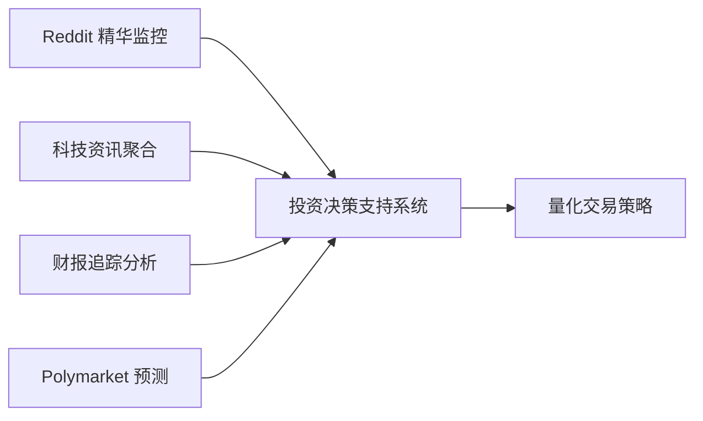

# 🦞 OpenClaw 真实可落地案例分析与思路

> 基于 GitHub 项目 [hesamsheikh/awesome-openclaw-usecases](https://github.com/hesamsheikh/awesome-openclaw-usecases) 的深度分析

## 🔍 项目概述

OpenClaw 是一个强大的 AI 助手框架，通过社区贡献的真实用例展示了其在日常生活和工作中的实际价值。这些用例不仅仅是概念验证，而是经过实际验证、能够真正改善生活质量的解决方案。

## 📊 核心用例分类

### 1. 信息聚合与摘要
- **Daily Reddit Digest** - 自动汇总指定 subreddit 精华内容
- **Daily YouTube Digest** - 监控关注频道，生成视频摘要  
- **Multi-Source Tech News Digest** - 聚合 109+ 科技资讯源
- **AI Earnings Tracker** - 跟踪财报发布，生成投资洞察

### 2. 自动化工作流
- **Autonomous Game Dev Pipeline** - 完整游戏开发生命周期管理
- **Podcast Production Pipeline** - 全流程播客制作自动化
- **YouTube Content Pipeline** - 视频创作全流程支持
- **Multi-Agent Content Factory** - 多智能体协作内容生产

### 3. 个人生产力
- **Self-Healing Home Server** - 自修复家庭服务器管理
- **Personal CRM** - 自动联系人发现和跟踪
- **Health & Symptom Tracker** - 健康数据追踪与分析
- **Family Calendar & Household Assistant** - 家庭日程和事务管理

### 4. 商业应用
- **Multi-Channel AI Customer Service** - 多渠道客户服务统一
- **Autonomous Project Management** - 多智能体项目协调
- **Market Research & Product Factory** - 市场痛点挖掘与 MVP 开发

### 5. 金融与投资
- **Polymarket Autopilot** - 预测市场自动化交易
- **Pre-Build Idea Validator** - 产品创意验证与竞争分析

## 🎯 重点关注用例深度解析

### Polymarket Autopilot（预测市场自动化）

**核心功能：**
- 自动纸面交易（paper trading）
- 策略回测与优化
- 每日性能报告生成
- 风险控制机制

**技术实现要点：**
- 定时任务调度（cron jobs）
- Polymarket API 集成
- 量化策略算法执行
- 可视化报告生成

**可扩展方向：**
- 结合新闻情绪分析调整策略
- 多市场套利机会识别
- 机器学习模型优化交易信号

### 量化炒股自动化组合方案

虽然项目中没有直接的"量化炒股"用例，但可以通过以下组合实现：

**组件说明：**
- **Reddit 精华**：捕捉社区情绪和热点话题
- **科技资讯**：识别技术创新和行业趋势  
- **财报追踪**：基本面分析和事件驱动机会
- **预测市场**：市场情绪和概率预测

### 内容创作者工具包

**YouTube 监控实现方案：**
1. 使用 YouTube Data API 获取频道最新视频
2. 提取视频元数据（标题、描述、标签）
3. AI 生成内容摘要和关键点提取
4. 推送到用户首选通知渠道

**优势价值：**
- 不错过关注创作者的新内容
- 节省观看时间，快速了解要点
- 关键词过滤，专注特定主题

### 游戏开发全流程自动化

基于 **Autonomous Game Dev Pipeline** 用例：

**完整生命周期管理：**
1. **需求收集**：从 Discord/Reddit 收集玩家反馈
2. **任务规划**：自动生成开发 backlog
3. **代码实现**：调用 coding agent 编写代码  
4. **Bug 优先**：严格执行 "Bugs First" 策略
5. **文档生成**：自动创建 README 和用户手册
6. **版本发布**：自动打 tag 和发布
7. **用户反馈**：监控评论并规划下个版本

## 🛠️ 实施建议与最佳实践

### 起步阶段推荐顺序

| 阶段 | 用例类型 | 难度 | 价值 |
|------|----------|------|------|
| 1 | 信息聚合 | ⭐⭐ | ⭐⭐⭐ |
| 2 | 工作流自动化 | ⭐⭐⭐ | ⭐⭐⭐⭐ |
| 3 | 复杂项目 | ⭐⭐⭐⭐⭐ | ⭐⭐⭐⭐⭐ |

### 技术准备清单

- ✅ **API 密钥管理**：Reddit、YouTube、Twitter/X、Polymarket
- ✅ **OpenClaw 配置**：确保浏览器服务和技能正常
- ✅ **安全考虑**：避免硬编码密钥，使用环境变量
- ✅ **测试策略**：先用模拟数据测试，再投入实际使用

### 成本收益分析

| 用例类型 | 开发难度 | 维护成本 | 实际价值 | ROI |
|---------|---------|---------|---------|-----|
| 信息聚合 | ⭐⭐ | ⭐ | ⭐⭐⭐ | 高 |
| 量化交易 | ⭐⭐⭐⭐ | ⭐⭐⭐ | ⭐⭐⭐⭐ | 极高 |
| 游戏开发 | ⭐⭐⭐⭐⭐ | ⭐⭐⭐⭐ | ⭐⭐⭐ | 中高 |

## 💡 创新组合思路

### 个人投资助手组合包
- Reddit 精华 + 科技资讯聚合 + 财报追踪 + Polymarket 预测
- 形成完整的投资决策支持系统

### 内容创作者效率套件  
- YouTube 监控 + Reddit 趋势分析 + 自动化内容工厂
- 帮助创作者发现热点、生成内容、管理发布

### 开发者生产力增强包
- 游戏开发流水线 + 项目管理 + 会议记录自动化
- 全流程提升开发效率

## ⚠️ 重要注意事项

1. **安全第一**：所有涉及金融的用例都要先用模拟模式测试
2. **合规性**：遵守各平台的 API 使用条款和速率限制
3. **渐进式开发**：不要试图一次性实现所有功能，分阶段迭代
4. **监控和日志**：确保有完善的错误处理和通知机制
5. **备份策略**：定期备份配置和数据，防止意外丢失

## 🔮 未来发展方向

- **多模态集成**：结合图像、音频、视频处理能力
- **跨平台同步**：在不同设备和平台间无缝同步状态
- **个性化学习**：基于用户行为自动优化策略和偏好
- **社区协作**：共享和复用经过验证的用例模板

## 📚 相关资源

- [Awesome OpenClaw Usecases GitHub](https://github.com/hesamsheikh/awesome-openclaw-usecases)
- [OpenClaw 官方文档](https://docs.openclaw.ai)
- [ClawHub 技能市场](https://clawhub.com)

---
*本文档将持续更新，记录 OpenClaw 实际应用的最佳实践和新发现。*